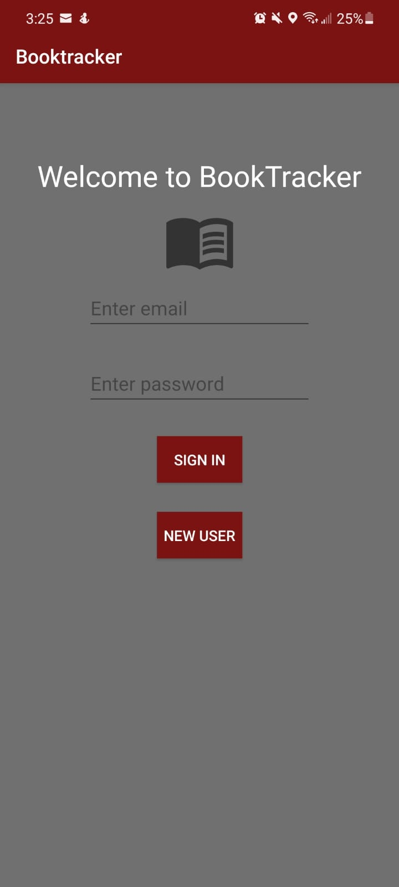
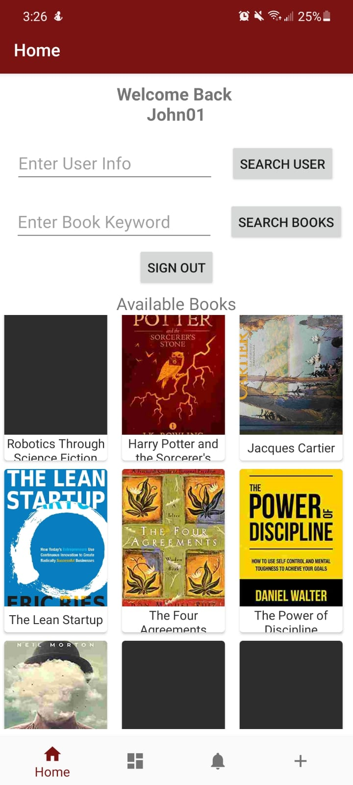
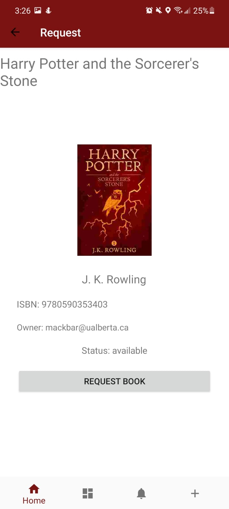
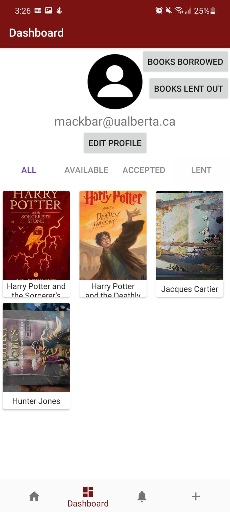
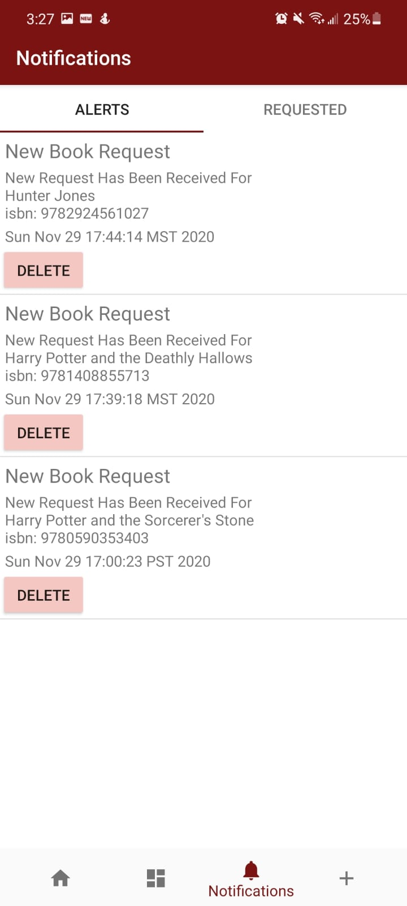
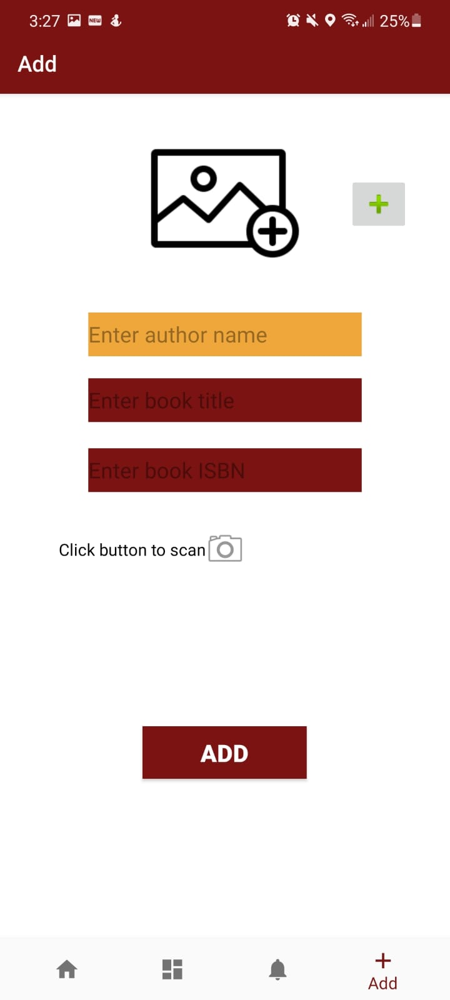
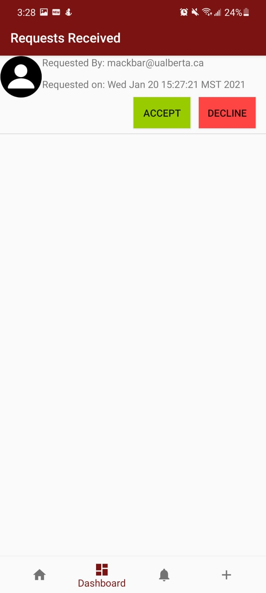
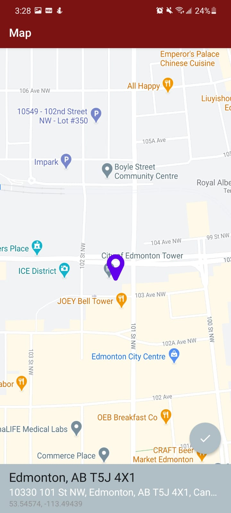

# BookTracker-App
Android application where users can lend and borrow books. Uses NoSQL Firebase database to store information in real-time. 

-Sign in

-Users can look through all available books or search for specific books/users

-Book screen shows status, ISBN, book owner and picture if available

-User books tab, where they can sort books by status to see lent or borrowed books

-Notifications tab shows all book requests, accepts, declines, etc; app also uses push notifications

-User can add books by scanning ISBN which auto-fills information, or manually. Users can also attach an image to their book.

-Accept or decline requests

-Owner can set book pickup location which borrower can also see

